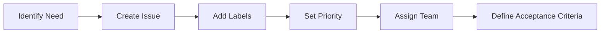
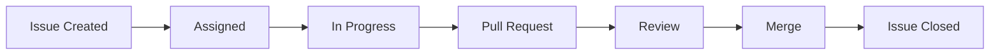

# Issue Driven Development (IDD) for FinFlow

## Overview

FinFlow follows the **Issue Driven Development (IDD)** paradigm, where every piece of development work is organized, tracked, and managed through GitHub Issues. This approach ensures complete traceability, clear accountability, and systematic progress toward our "boring AI" goals.

## What is Issue Driven Development?

Issue Driven Development is a software development methodology where:

1. **Every task becomes an issue** - No development work happens without a corresponding GitHub issue
2. **Hierarchical organization** - Epics → Features → Tasks → Bugs
3. **Complete traceability** - Every commit, PR, and deployment is linked to issues
4. **Workflow automation** - GitHub Actions triggered by issue events (IssueOps)
5. **Team coordination** - Clear assignments and dependencies

## Industry Adoption

IDD is used by:
- **GitHub itself** - Uses sub-issues and IssueOps for internal development
- **Major open source projects** - For managing contributions and releases
- **Enterprise teams** - For workflow automation and compliance tracking
- **DevOps organizations** - For CI/CD automation through IssueOps

## FinFlow IDD Structure

### Issue Hierarchy

```
EPIC (Strategic Level)
├── Feature Issue (Tactical Level)
│   ├── Implementation Task
│   ├── Testing Task
│   └── Documentation Task
└── Bug Issue (Maintenance Level)
```

### Issue Types and Labels

| Type | Label | Description | Assignee Type |
|------|-------|-------------|---------------|
| Epic | `epic` | Large strategic initiatives | Team Lead |
| Feature | `feature` | Specific functionality | Domain Expert |
| Task | `task` | Implementation work | Developer |
| Bug | `bug` | Defect resolution | Assigned Developer |
| Security | `security` | Security-related work | Security Expert |
| Compliance | `compliance` | Regulatory requirements | Legal Expert |

### Priority Levels

| Priority | Label | SLA | Description |
|----------|-------|-----|-------------|
| Critical | `critical` | 24 hours | System-breaking issues |
| High | `high-priority` | 3 days | Important features/fixes |
| Medium | `medium-priority` | 1 week | Standard development |
| Low | `low-priority` | 2 weeks | Nice-to-have features |

## satware.ai Team Assignments

### Core Team Members

| Agent | Expertise | GitHub Handle | Primary Responsibilities |
|-------|-----------|---------------|-------------------------|
| **Jane Alesi** | Lead AI Architect | `jane-alesi` | Project coordination, architecture review |
| **Leon Alesi** | IT System Integration | `leon-alesi` | Infrastructure, CI/CD, integration |
| **John Alesi** | Software Development | `john-alesi` | Core development, workflow engine |
| **Justus Alesi** | Legal/Compliance | `justus-alesi` | Regulatory compliance, audit framework |
| **Theo Alesi** | Financial Domain | `theo-alesi` | Financial requirements, domain expertise |

### Assignment Strategy

1. **Primary Assignee**: Responsible for issue completion
2. **Supporting Team**: Provides expertise and review
3. **Domain Expert**: Ensures business requirements are met
4. **Reviewer**: Validates technical and compliance aspects

## Issue Workflow

### 1. Issue Creation


### 2. Development Workflow


### 3. IssueOps Automation

- **Auto-assignment** based on labels and expertise
- **Progress tracking** with GitHub Project boards
- **CI/CD triggers** based on issue state changes
- **Compliance validation** integrated into issue workflow

## Current Issue Structure

### Phase 1 Epics

| Issue # | Title | Assignee | Status | Dependencies |
|---------|-------|----------|--------|--------------|
| #1 | Core Infrastructure Setup | Leon Alesi | Open | None |
| #4 | Core Workflow Engine | John Alesi | Open | #1, #2 |
| #5 | Compliance Framework | Justus Alesi | Open | #4, #1 |
| #6 | Legacy Integration | Leon Alesi | Open | #1, #4 |

### Implementation Tasks

| Issue # | Title | Assignee | Parent | Priority |
|---------|-------|----------|--------|-----------|
| #2 | Maven Multi-Module Setup | Leon Alesi | #1 | High |
| #3 | Docker Compose Environment | Leon Alesi | #1 | High |
| #7 | Zero-Trust Security | Leon Alesi | #1 | Critical |
| #8 | CI/CD Pipeline | Leon Alesi | #1 | High |
| #9 | Workflow DSL Design | John Alesi | #4 | High |
| #10 | TDD Framework | John Alesi | #4 | Critical |

## Best Practices

### Issue Creation

1. **Clear Title**: Descriptive and actionable
2. **Detailed Description**: Business value, technical requirements
3. **Acceptance Criteria**: Specific, measurable outcomes
4. **Proper Labels**: Type, priority, component
5. **Team Assignment**: Primary and supporting roles

### Issue Management

1. **Regular Updates**: Progress comments and status changes
2. **Dependency Tracking**: Clear parent-child relationships
3. **Milestone Association**: Link to release goals
4. **Documentation**: Link to relevant docs and decisions

### Quality Gates

1. **Definition of Done**: All acceptance criteria met
2. **Code Review**: Technical validation
3. **Compliance Check**: Regulatory requirements
4. **Testing**: Unit, integration, and compliance tests
5. **Documentation**: Updated and reviewed

## Compliance Integration

### Regulatory Tracking

- **MiFID II**: Issues tagged with `mifid-ii`
- **GDPR**: Issues tagged with `gdpr`
- **PSD3**: Issues tagged with `psd3`
- **ESG**: Issues tagged with `esg`

### Audit Trail

- Every issue linked to regulatory requirements
- Complete history of decisions and changes
- Automated compliance validation in CI/CD
- Regular compliance reporting

## Success Metrics

| Metric | Target | Current | Tracking |
|--------|--------|---------|----------|
| Issue Completion Rate | 95% | TBD | Weekly |
| Cycle Time | < 5 days | TBD | Per issue |
| Dependency Blocking | < 5% | TBD | Daily |
| Compliance Coverage | 100% | TBD | Per release |

## Tools and Integration

### GitHub Features
- **Issues**: Primary tracking mechanism
- **Project Boards**: Visual workflow management
- **Milestones**: Release planning
- **Labels**: Categorization and filtering
- **Actions**: Automation and IssueOps

### External Tools
- **Slack**: Issue notifications and updates
- **Jira**: Enterprise project management (if needed)
- **Confluence**: Documentation linking
- **SonarQube**: Code quality tracking

## Getting Started

1. **Review Current Issues**: Understand the existing structure
2. **Choose Your Issues**: Based on expertise and priority
3. **Update Progress**: Regular comments and status updates
4. **Follow Workflow**: Create PRs linked to issues
5. **Validate Completion**: Ensure all acceptance criteria are met

## Resources

- [GitHub Issues Documentation](https://docs.github.com/en/issues)
- [GitHub Project Boards](https://docs.github.com/en/issues/organizing-your-work-with-project-boards)
- [IssueOps Best Practices](https://github.blog/engineering/issueops-automate-ci-cd-and-more-with-github-issues-and-actions/)
- [FinFlow Architecture Documentation](./ARCHITECTURE.md)
- [Compliance Framework](./COMPLIANCE.md)

---

**Remember**: In Issue Driven Development, if it's not in an issue, it doesn't exist. Every piece of work should be traceable, accountable, and aligned with our "boring AI" philosophy of reliable, measurable progress.